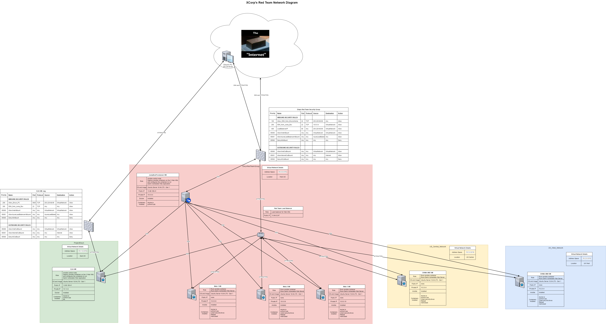

## Automated ELK Stack Deployment

The files in this repository were used to configure the network depicted below.

These files have been tested and used to generate a live ELK deployment on Azure. They can be used to either recreate the entire deployment pictured above. Alternatively, select portions of the files may be used to install only certain pieces of it, such as Filebeat.

  - [hosts](Ansible/hosts) - Ansible hosts configuration file
  - [pentest.yml](Ansible/pentest.yml) - Ansible playbook YML file that installs Docker, Python and Damn Vulnerable Web Application on virtual machines
  - [install-elk.yml](Ansible/install-elk.yml) - Ansible playbook YML file that installs ELK on ELK-VM
  - [filebeat-config.yml](Ansible/filebeat/filebeat-config.yml) - Configuration file for filebeat
  - [filebeat-playbook.yml](Ansible/filebeat/filebeat-playbook.yml) - Ansible playbook YML file for filebeat
  - [metricbeat-config.yml](Ansible/metricbeat/metricbeat-config.yml) - Configuration file for metricbeat
  - [metricbeat-playbook.yml](Ansible/metricbeat/metricbeat-playbook.yml) - Ansible playbook YML file for metricbeat
 
This document contains the following details:
- Description of the Topologu
- Access Policies
- ELK Configuration
  - Beats in Use
  - Machines Being Monitored
- How to Use the Ansible Build

### Description of the Topology

The main purpose of this network is to expose a load-balanced and monitored instance of DVWA, the D\*mn Vulnerable Web Application.

Load balancing ensures that the application will be highly stable and balanced, in addition to restricting access to the network.

The load balancer is designed to protect the availability of the system by distributing the access of the system across multiple identical web servers. 
The advantage of using the jump box VM is that it can deploy identically configured systems in a repeatable manner.

Integrating an ELK server allows users to easily monitor the vulnerable VMs for changes to the _____ and system _____.
- _TODO: What does Filebeat watch for?_
- _TODO: What does Metricbeat record?_

The configuration details of each machine may be found below.
_Note: Use the [Markdown Table Generator](http://www.tablesgenerator.com/markdown_tables) to add/remove values from the table_.

| Name     | Function   | Private IP | Public IP        | Operating System |
|----------|------------|------------|------------------|------------------|
| Jump Box | Gateway    | 10.0.0.4   | 13.88.189.41     | Linux (Ubuntu)   |
| Web-1 VM | Web Server | 10.0.0.8   | none             | Linux (Ubuntu)   |
| Web-2 VM | Web Server | 10.0.0.9   | none             | Linux (Ubuntu)   |
| Web-3 VM | Web Server | 10.0.0.10  | none             | Linux (Ubuntu)   |
| ELK-VM   | ELK Server | 10.1.0.4   | 13.88.189.41     | Linux (Ubuntu)   |
| DVWA-VM3 | Web Server | 10.3.0.4   | none             | Linux (Ubuntu)   |
| DVWA-VM4 | Web Server | 10.2.0.4   | none             | Linux (Ubuntu)   |
| DVWA-VM4 | Web Server | 10.2.0.4   | none             | Linux (Ubuntu)   |
| Load Balancer | Load Balancer |    | 13.64.8.247      | | 

### Access Policies

The machines on the internal network are not exposed to the public Internet. 

Only the Jumpbox machine can accept SSH connections from the Internet. Access to this machine is only allowed from the following IP addresses:
- 203.220.68.69 which is my home PC's IP address

Machines within the network can only be accessed by other machines within the virtual network.
- JumpBox Provisioner has access to the Web and DVWM machines to install DVWM in a Docker container
- JumpBox Provisioner has access to the ELK-VM machine to install ELK in a Docker container 
- The Web and DVWM VMs send metric data to the ELK machine.

A summary of the access policies in place can be found in the table below.

| Name                   | Publicly Accessible | Allowed IP Addresses           |
|------------------------|---------------------|---------------------------------|
| Jump Box               | Yes                 | 203.220.68.69 (Elwyn's PC)      |
| Load Balancer          | Yes                 | 203.220.68.69 (Elwyn's PC)      |
| ELK VM                 | Yes                 | 203.220.68.69 (Elwyn's PC)      |
| Other machines in vNet | No                  | 10.0.0.4 (Jump Box Provisioner) |

### Elk Configuration

Ansible was used to automate configuration of the ELK machine. No configuration was performed manually, which is advantageous because...
- the installation is easily repeatable

The playbook implements the following tasks:
- _TODO: In 3-5 bullets, explain the steps of the ELK installation play. E.g., install Docker; download image; etc._
- ...
- ...

The following screenshot displays the result of running `docker ps` after successfully configuring the ELK instance.

### Target Machines & Beats
This ELK server is configured to monitor the following machines:
- Web-1: 10.0.0.8
- Web-2: 10.0.0.9
- Web-3: 10.0.0.10
- DVWA-VM3: 10.3.0.4
- DVWA-VM4: 10.2.0.4

We have installed the following Beats on these machines:
- filebeat
- metricbeat

These Beats allow us to collect the following information from each machine:
- _TODO: In 1-2 sentences, explain what kind of data each beat collects, and provide 1 example of what you expect to see. E.g., `Winlogbeat` collects Windows logs, which we use to track user logon events, etc._

### Using the Playbook
In order to use the playbook, you will need to have an Ansible control node already configured. Assuming you have such a control node provisioned: 

SSH into the control node and follow the steps below:
- Copy the files [hosts](Ansible/hosts), [pentest.yml](Ansible/pentest.yml), and [install-elk.yml] to /etc/ansible.
- Copy the [filebeat-playbook.yml](Ansible/filebeat/filebeat-playbook.yml) and [metricbeat-playbook.yml](Ansible/metricbeat/metricbeat-playbook.yml) files to /etc/ansible/roles
- Copy the configuration files [filebeat-config.yml](Ansible/filebeat/filebeat-config.yml) and [metricbeat-config.yml](Ansible/metricbeat/metricbeat-config.yml) to /etc/ansible/files
- Update the [hosts](Ansible/hosts) file to include the IP addresses of the Web, DVWA and ELK machines
- Run the playbook, and navigate to ____ to check that the installation worked as expected.

_TODO: Answer the following questions to fill in the blanks:_
- _Which file is the playbook? Where do you copy it?_
- _Which file do you update to make Ansible run the playbook on a specific machine? How do I specify which machine to install the ELK server on versus which to install Filebeat on?_
- _Which URL do you navigate to in order to check that the ELK server is running?

_As a **Bonus**, provide the specific commands the user will need to run to download the playbook, update the files, etc._
